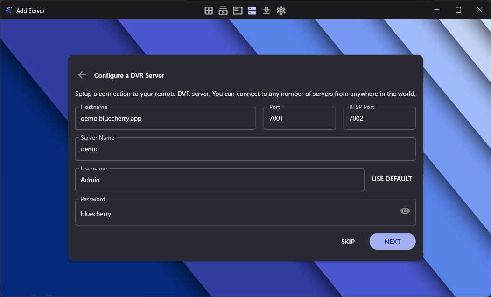
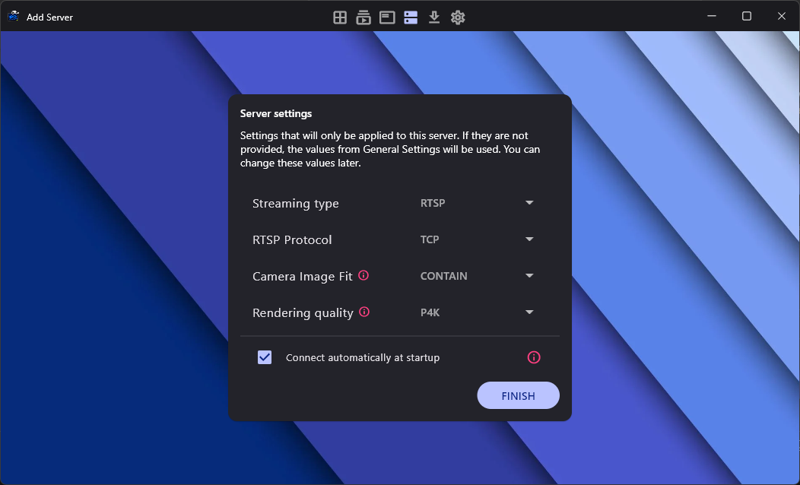
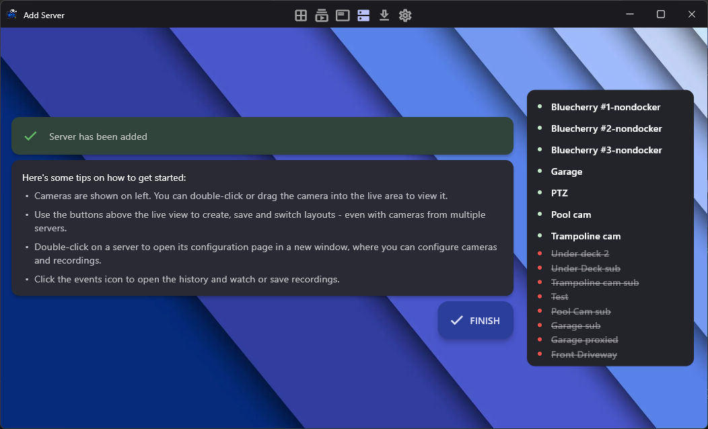
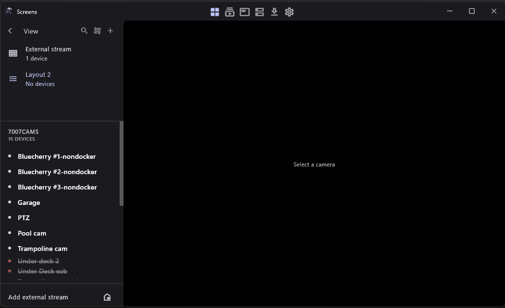
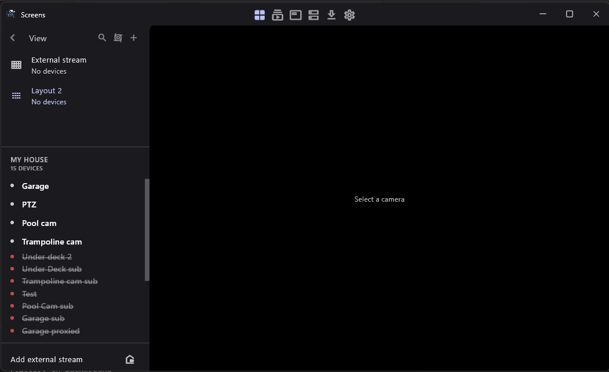
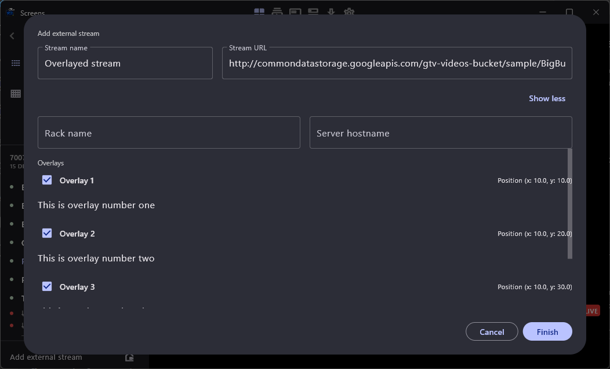

# Usage

This document explains how to use the Bluecherry Client and list all its features.

## Table of contents

- [Overview](#overview)
- [Download, Installation](#download-installation)
- [Requirements](#requirements)
- [Connecting to the server](#connecting-to-the-server)
- [Viewing cameras](#viewing-cameras)
  - [PTZ](#ptz)
  - [`beta` Matrix zoom](#beta-matrix-zoom)
- [Layouts](#layouts)
  - [Multiple Layout](#multiple-layout)
  - [Compact layout](#compact-layout)
  - [Cycling](#cycling)
  - [External streams](#external-streams)
- [Open app from configuration file](#open-app-from-configuration-file)
- `TODO` [Events](#events)
  - `TODO` [Browse events](#browse-events)
  - `TODO` [Timeline of Events](#timeline-of-events)
  - `TODO` [Events details](#events-details)
  - `TODO` [Downloads](#downloads)
- `TODO` [Updating](#updating)

## Overview

The Bluecherry Client lets you watch live and recorded video from your Bluecherry server. It is a cross-platform application that runs on Android, iOS, Windows, macOS, and Linux.

## Download, Installation

Refer to [README.md](./README.md#download) for installation instructions.

## Requirements

You will need a Bluecherry server to use this application. You can buy a license from the [Bluecherry website](https://www.bluecherrydvr.com/).

## Connecting to the server

These steps will guide you through easily connecting to your Bluecherry server. You can add as much servers as necessary. The steps are similar for all platforms.

`1.` Enter the hostname or IP address of the Bluecherry server. The default login and password for new installations is `Admin` and `bluecherry`. You can optionally click `Use default` to have this information automatically entered for you.



Click `Next` to connect.

`2.` You can optionally change some settings for the server, such as the streaming type, RTSP protocol, and rendering quality.



You can optionally leave these as they are. Click `Finish` to add the server.

`3.` If the server was successfully added, you will be able to see the server in the server list and view the cameras.



Click `Finish` to close the process.

## Viewing cameras

After your server is added, you will be redirected to the camera list. You can view the live video from the cameras by clicking on them or by dragging them to the layout.



You can repeat this process or any camera or DVR that you have listed on the left side. Note: It’s possible to connect as many devices together as you need, and mix and match the videos in different layouts.

## PTZ

The PTZ feature allows you to control the pan, tilt, and zoom of a camera. To enable it, click on the `PTZ` button on the camera tile.

> [!Note]
> The PTZ feature is only available for cameras that support PTZ. If the camera does not support PTZ, the PTZ button will not be available.

You can press and move the mouse to control the camera. 


You can perform the following movements:

  * Pan: Press and move the mouse left or right.
  * Tilt: Press and move the mouse up or down.
  * Zoom: Scroll the mouse wheel up or down.

The PTZ movements are scheduled and will be executed after the previous movement is completed. Depending on the speed of the internet connection, you can experience minor delays between the movements and the camera response.

> [!Tip]
> It is recommended to wait for the camera to complete the previous movement before performing another one, but scheduling multiple movements is possible.

> [!Important]
> PTZ zoom is not supported on mobile devices. See [this issue](https://github.com/bluecherrydvr/unity/issues/107).

## [beta] Matrix zoom

The matrix view is a feature that allows you to zoom into a camera. This is useful for multicast streams. This works better with cameras with larger resolutions.

To enable it, go to `Settings` -> `Updates` -> `Beta Features` -> `Matrix view zoom`.


## Layouts

You can create layouts to organize the cameras. You can add cameras to the layout by dragging them from the camera list to the layout.

### Multiple Layout

The multiple layout allows you to view as many cameras as you want in a grid. The grid will adapt to the number of cameras you add.

### Compact layout

The compact layouts creates a 2x2 grid with sub 2x2 grids. This is useful for viewing a large number of cameras in a small space.

### Cycling

You can enable the cycling to change the layouts automatically at a given interval (defaults to 30 seconds). This is useful for monitoring a large number of cameras.

### External streams

You can add external streams to the layout. This is useful for adding streams from other sources, such as webcams, IP cameras, or other Bluecherry servers.

To add an external stream, click on the `Add external stream` tile and enter the stream URL:



> In the example above, we add a test video to the layout.

External streams are added to the `External Stream` layout.

## Open app from configuration file

You can open the app from a configuration file. This is useful for opening the app from a web browser or from a file manager. The configuration file is a `.bluecherry` file that contains the devices data.

Here is an example of a configuration file:

```
[stream]
video = rtsp://demo.bluecherry.app:7002/live/1

[videoscreen]
fullscreen = false

[audio]
sound = true
```

* The `stream` section contains the video URL. The app will try to connect to this URL when it is opened.

* The `videoscreen` section contains the fullscreen setting, which determines if the app should open in fullscreen mode or add the video to the layout.

* The `audio` section contains the sound setting, which determines if the stream should have sound or not.

You can open the app from the configuration file by double-clicking it and opening it with the Bluecherry Client.

Additionally, you can add overlays to the video by adding the following sections to the configuration file:

```
[overlay]
text = "This is overlay number threee"
size = 24
color = #000000
opacity = 80
show = true
position_x = 10
position_y = 30
```

* The `overlay` section contains the text, size, color, opacity, show, position_x, and position_y settings. The overlay is persistent and will be shown on top of the video.

* The `position_x` and `position_y` determines the position of the overlay on the video, being `0` the top-left corner of the video.

The overlay can be edited from within the app:



Press `Finish` to add the stream to the layout.


